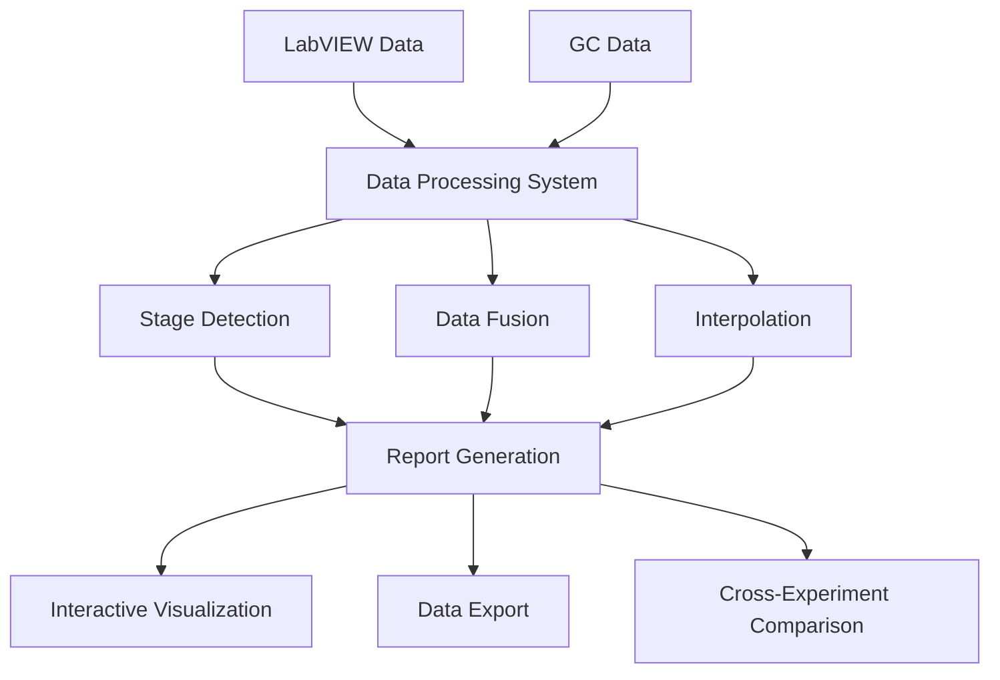
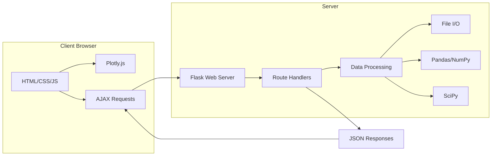
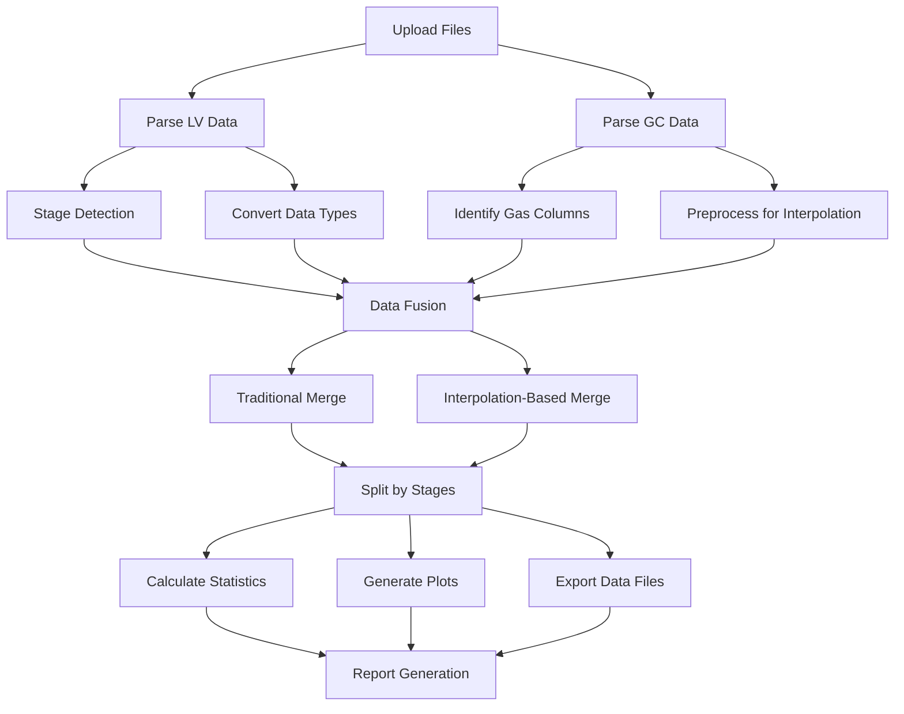

# Skid NH3 Synthesis Data Manager


A comprehensive data management, processing, and visualization platform for NH3 synthesis experiments, supporting advanced integration of LabVIEW (LV) and Gas Chromatography (GC) data with intelligent interpolation algorithms.

[](https://opensource.org/licenses/MIT)
[](https://www.python.org/downloads/)
[](https://flask.palletsprojects.com/)
[](https://pandas.pydata.org/)
[](https://plotly.com/)

## Table of Contents

- [Introduction](#introduction)
- [Key Features](#key-features)
- [System Architecture](#system-architecture)
- [Installation](#installation)
  - [Prerequisites](#prerequisites)
  - [Setup Instructions](#setup-instructions)
  - [Docker Installation](#docker-installation)
- [Quick Start Guide](#quick-start-guide)
- [Data Processing Workflow](#data-processing-workflow)
  - [File Upload](#file-upload)
  - [Data Processing](#data-processing)
  - [Results Visualization](#results-visualization)
  - [Data Export and Analysis](#data-export-and-analysis)
- [GC Data Integration](#gc-data-integration)
  - [GC File Format](#gc-file-format)
  - [GC Column Detection](#gc-column-detection)
  - [Time Alignment](#time-alignment)
  - [GC Interpolation Process](#gc-interpolation-process)
  - [Visualization of GC Data](#visualization-of-gc-data)
- [Advanced Interpolation Methods](#advanced-interpolation-methods)
  - [Cubic Interpolation](#cubic-interpolation)
  - [Linear Interpolation](#linear-interpolation)
  - [Quadratic Interpolation](#quadratic-interpolation)
  - [Nearest Interpolation](#nearest-interpolation)
  - [Uniform Time Grid](#uniform-time-grid)
  - [Method Selection Guide](#method-selection-guide)
- [Stage Detection and Analysis](#stage-detection-and-analysis)
  - [Automatic Stage Detection](#automatic-stage-detection)
  - [Stage Statistics](#stage-statistics)
  - [Stage Comparison](#stage-comparison)
- [Reports and Visualization](#reports-and-visualization)
  - [Interactive Plots](#interactive-plots)
  - [Multi-axis Visualization](#multi-axis-visualization)
  - [Cross-Report Comparison](#cross-report-comparison)
- [API Reference](#api-reference)
  - [REST API Endpoints](#rest-api-endpoints)
  - [File Processing API](#file-processing-api)
  - [Report Management API](#report-management-api)
- [Web Interface Guide](#web-interface-guide)
  - [Dashboard](#dashboard)
  - [Upload Page](#upload-page)
  - [Reports Page](#reports-page)
  - [Visualization Page](#visualization-page)
- [Technical Implementation](#technical-implementation)
  - [Data Structures](#data-structures)
  - [Algorithm Details](#algorithm-details)
  - [Performance Considerations](#performance-considerations)
- [File Structure](#file-structure)
- [Data Requirements](#data-requirements)
  - [LV Data Format](#lv-data-format)
  - [GC Data Format](#gc-data-format)
- [Advanced Usage](#advanced-usage)
  - [Command Line Interface](#command-line-interface)
  - [Configuration Options](#configuration-options)
  - [Custom Plot Generation](#custom-plot-generation)
- [Troubleshooting](#troubleshooting)
  - [Common Issues](#common-issues)
  - [Error Messages](#error-messages)
  - [Debugging Tools](#debugging-tools)
- [Contributing](#contributing)
- [License](#license)
- [Acknowledgements](#acknowledgements)
- [Real-World Use Cases](#real-world-use-cases)

## Introduction

The Skid NH3 Synthesis Data Manager is a specialized platform designed for scientists and engineers working with ammonia synthesis experiments. It addresses the fundamental challenge of integrating time-series data from different instruments - particularly LabVIEW (LV) process control data and Gas Chromatography (GC) composition measurements - into a unified dataset for comprehensive analysis.

The system offers advanced data fusion techniques, intelligent stage detection, interactive visualizations, and cross-experiment comparison capabilities. This enables researchers to gain deeper insights into experimental conditions, catalyst performance, and process optimization opportunities.



## Key Features

The Skid NH3 Synthesis Data Manager offers a comprehensive set of features for processing, analyzing, and visualizing experimental data:

### Core Processing Capabilities

- **Unified Data Processing**: Process both LV data (temperature, pressure, flow) and GC data (H2, N2, NH3 concentrations) in a single workflow
- **Intelligent Stage Detection**: Automatically identify experimental stages based on relative time resets or process conditions
- **Multi-format Support**: Import data from standard tab-delimited text files exported from various instruments

### Advanced Data Fusion

- **Traditional Merge**: Simple timestamp-based matching with configurable time tolerance
- **Advanced Interpolation**: Multiple interpolation methods for GC concentration values:
  - **Cubic Interpolation**: Smooth curves with continuous first derivatives
  - **Linear Interpolation**: Simple straight lines between points
  - **Quadratic Interpolation**: Balanced approach between linear and cubic
  - **Nearest Interpolation**: Step-function interpolation for categorical data

### Time Series Management

- **Uniform Time Grid**: Resample data to consistent time intervals (30s, 1min, 2min, 5min, 10min)
- **Timestamp Alignment**: Intelligently align data from different sources with varying sampling rates
- **Time Range Selection**: Focus analysis on specific time periods of interest

### Visualization and Analysis

- **Interactive Plots**: Multi-axis interactive visualizations with Plotly
- **Parameter Grouping**: Intelligent grouping of related parameters on appropriate axes
- **Stage-by-Stage Analysis**: Detailed statistics for each experimental stage
- **Cross-Experiment Comparison**: Compare data across different experiments and stages

### Data Management

- **Organized Reports**: Structured storage of processed data, plots, and statistics
- **Flexible Exports**: Download data in CSV and JSON formats for further analysis
- **Report Management**: Rename, organize, and delete reports through the interface

## System Architecture

The Skid NH3 Data Manager is built on a modern web application architecture with a Python backend and JavaScript frontend:



The system operates on a file-based storage model, organizing processed data, visualizations, and statistics in a structured folder hierarchy. This architecture provides simplicity, reliability, and easy backup capabilities without requiring a database system.

## Installation

### Prerequisites

- Python 3.7 or higher
- pip (Python package manager)
- Modern web browser (Chrome, Firefox, Edge recommended)
- At least 4GB of available RAM for processing large datasets

### Setup Instructions

1. Clone the repository:
   ```bash
   git clone https://github.com/yourusername/skid-nh3-data-manager.git
   cd skid-nh3-data-manager
   ```

2. Create a virtual environment (recommended):
   ```bash
   python -m venv venv
   
   # On Windows
   venv\Scripts\activate
   
   # On macOS/Linux
   source venv/bin/activate
   ```

3. Install the required dependencies:
   ```bash
   pip install -r requirements.txt
   ```

4. Run the application:
   ```bash
   python app.py
   ```

5. Open your browser and navigate to:
   ```
   http://localhost:6007
   ```

### Docker Installation

For containerized deployment, you can use Docker:

```bash
# Build the Docker image
docker build -t skid-nh3-data-manager .

# Run the container
docker run -p 6007:6007 -v $(pwd)/data:/app/data skid-nh3-data-manager
```

## Quick Start Guide

1. **Prepare your data files**:
   - Ensure your LV data is in tab-separated text format with datetime and relative time columns
   - Prepare your GC data in tab-separated text format with datetime and concentration columns

2. **Upload and process**:
   - Navigate to the Upload page
   - Select your LV and GC data files
   - Choose processing options (optional)
   - Click "Process Files"

3. **Explore results**:
   - View the overall merged data plot
   - Examine individual stage plots and statistics
   - Download processed data for further analysis

```python
# Example code snippet to process files programmatically
from main_web_processor import generate_reports

results = generate_reports(
    lv_file_path='path/to/lv_data.txt',
    gc_file_path='path/to/gc_data.txt',
    base_output_folder='./output',
    report_prefix_text='Experiment1',
    use_interpolation=True,
    interpolation_kind='cubic',
    use_uniform_grid=True,
    grid_freq='1min'
)

print(f"Processing completed: {results['success']}")
print(f"Generated {len(results['step_reports'])} stage reports")
```

## Data Processing Workflow

The data processing workflow consists of several interconnected steps, from file upload to final visualization and analysis.

### File Upload

The system accepts two primary file types:

1. **LabVIEW (LV) data files**:
   - Contains process variables (temperature, pressure, flow rates)
   - Includes timestamps and relative time values
   - Used for stage detection and providing the primary timeline

2. **Gas Chromatography (GC) data files**:
   - Contains gas concentration measurements (H2, N2, NH3)
   - Includes timestamps for each measurement
   - Typically has a lower sampling frequency than LV data


```html
<!-- Example of the upload form structure -->
<form action="/process" method="post" enctype="multipart/form-data">
    <div class="upload-section">
        <label for="lv_file">LabVIEW Data File:</label>
        <input type="file" id="lv_file" name="lv_file" accept=".txt">
    </div>
    
    <div class="upload-section">
        <label for="gc_file">GC Data File:</label>
        <input type="file" id="gc_file" name="gc_file" accept=".txt">
    </div>
    
    <div class="options-section">
        <label for="report_prefix_text">Report Prefix (optional):</label>
        <input type="text" id="report_prefix_text" name="report_prefix_text">
        
        <div class="advanced-options">
            <h3>Advanced Processing Options</h3>
            
            <div class="option-group">
                <input type="checkbox" id="use_interpolation" name="use_interpolation" value="true">
                <label for="use_interpolation">Use Advanced Interpolation</label>
            </div>
            
            <div class="interpolation-options">
                <label for="interpolation_kind">Interpolation Method:</label>
                <select id="interpolation_kind" name="interpolation_kind">
                    <option value="cubic">Cubic (Smooth)</option>
                    <option value="linear">Linear (Simple)</option>
                    <option value="quadratic">Quadratic (Balanced)</option>
                    <option value="nearest">Nearest (Step Function)</option>
                </select>
            </div>
            
            <div class="option-group">
                <input type="checkbox" id="use_uniform_grid" name="use_uniform_grid" value="true" checked>
                <label for="use_uniform_grid">Use Uniform Time Grid</label>
            </div>
            
            <div class="grid-options">
                <label for="grid_freq">Grid Frequency:</label>
                <select id="grid_freq" name="grid_freq">
                    <option value="30s">30 Seconds</option>
                    <option value="1min" selected>1 Minute</option>
                    <option value="2min">2 Minutes</option>
                    <option value="5min">5 Minutes</option>
                    <option value="10min">10 Minutes</option>
                </select>
            </div>
        </div>
    </div>
    
    <button type="submit" class="btn-primary">Process Files</button>
</form>
```

### Data Processing

Once files are uploaded, the system performs the following processing steps:

1. **LV Data Processing**:
   - Parse the tab-delimited text file to extract columns
   - Convert timestamps to datetime objects
   - Process relative time values
   - Identify experimental stages
   - Convert numeric columns to appropriate data types

2. **GC Data Processing**:
   - Parse the tab-delimited text file
   - Identify H2, N2, and NH3 concentration columns
   - Convert timestamps to datetime objects
   - Preprocess data for interpolation

3. **Data Fusion**:
   - Align LV and GC timestamps
   - Apply selected fusion method (traditional merge or interpolation)
   - Create a unified dataset with all variables

4. **Stage Analysis**:
   - Split data into separate stages
   - Calculate statistics for each stage
   - Generate stage-specific plots and data files

The following diagram illustrates the data processing pipeline:



### Results Visualization

After processing, the system generates a comprehensive report with various visualizations:

1. **Overall Plot**: Shows all process variables and GC data in a single interactive plot with multiple Y-axes
2. **GC Analysis Plots**: Dedicated visualizations showing GC data interpolation and alignment with LV data
3. **Stage-by-Stage Plots**: Individual plots for each experimental stage
4. **Comparison Plots**: Tools to compare multiple stages or experiments

### Data Export and Analysis

The system provides multiple export options for further analysis:

1. **CSV Export**: Download data in CSV format for analysis in Excel or other tools
2. **JSON Export**: Download data in JSON format for programmatic analysis
3. **Combined Stage Export**: Select multiple stages and download combined data
4. **Cross-Experiment Export**: Export data from multiple experiments for comparison

## GC Data Integration

Gas Chromatography (GC) data integration is a core feature of the system, addressing the challenge of combining sparse, irregularly sampled GC measurements with higher-frequency LV process data.

### GC File Format

The system expects GC data in a tab-delimited text file with the following format:

```
Date	Time	H2	N2	NH3	...Other columns...
21.05.2023	08:15:30	65.2	30.5	4.3	...
21.05.2023	08:30:15	64.8	31.2	4.0	...
21.05.2023	08:45:45	63.7	31.5	4.8	...
...
```

Key aspects of GC file handling:

- Dates can be in various formats (DD.MM.YYYY, MM/DD/YYYY, YYYY-MM-DD)
- Time values are expected in 24-hour format (HH:MM:SS)
- Column names for gas components can vary (e.g., H2, Hydrogen, H2_1)
- The system can handle multiple concentration columns for the same gas

### GC Column Detection

The system automatically identifies gas component columns using pattern matching:

```python
# Example code for gas column detection
h2_columns = [col for col in df_gc_sorted.columns if 'h2' in col.lower() or 'hydrogen' in col.lower() or '_h2' in col.lower()]
n2_columns = [col for col in df_gc_sorted.columns if 'n2' in col.lower() or 'nitrogen' in col.lower() or '_n2' in col.lower()]
nh3_columns = [col for col in df_gc_sorted.columns if 'nh3' in col.lower() or 'ammonia' in col.lower() or '_nh3' in col.lower()]
```

If the system identifies multiple columns for the same gas, it prioritizes:
1. Columns with clean, preprocessed data (e.g., H2_clean)
2. Columns with the most complete data (fewest NaN values)
3. The first matching column if multiple have the same quality

### Time Alignment

A critical challenge in GC integration is aligning GC measurements with LV timestamps. The system uses several approaches:

1. **Time Range Matching**: Identifying overlapping time periods between LV and GC data
2. **Relative Position Mapping**: Mapping GC timestamps to relative positions within the LV timeline
3. **Tolerance-Based Matching**: For traditional merge, using a configurable time tolerance (default: 5 minutes)


The system handles various time alignment scenarios:

| Scenario | Handling Approach |
|----------|-------------------|
| GC data covers full LV time range | Direct alignment of timestamps |
| GC data starts later than LV data | Extrapolation or NaN values for early LV points |
| GC data ends earlier than LV data | Extrapolation or NaN values for late LV points |
| Irregular GC sampling intervals | Interpolation between available GC points |

### GC Interpolation Process

When using advanced interpolation, the system creates continuous functions to estimate GC values at LV timestamps:

```python
# Example implementation of the interpolation process
def create_robust_interpolator(x, y, kind='cubic', fill_method='extrapolate'):
    # Handle NaN values
    mask = ~(np.isnan(x) | np.isnan(y))
    x_clean = x[mask]
    y_clean = y[mask]
    
    if len(x_clean) < 2:
        print(f"Warning: Insufficient data points ({len(x_clean)}) for interpolation.")
        return None
    
    # Check for duplicate x values
    if len(x_clean) != len(np.unique(x_clean)):
        print(f"Warning: Found duplicate x values. Removing duplicates keeping last occurrence.")
        temp_df = pd.DataFrame({'x': x_clean, 'y': y_clean})
        temp_df = temp_df.sort_values('x').drop_duplicates(subset='x', keep='last')
        x_clean = temp_df['x'].values
        y_clean = temp_df['y'].values
    
    # Check if we have enough points for the requested interpolation
    min_points = {'linear': 2, 'quadratic': 3, 'cubic': 4}
    required_points = min_points.get(kind, 2)
    
    if len(x_clean) < required_points:
        print(f"Warning: Insufficient data points ({len(x_clean)}) for {kind} interpolation. "
              f"Need at least {required_points}.")
        if len(x_clean) >= 2:
            print(f"Falling back to linear interpolation.")
            kind = 'linear'
        else:
            print(f"Cannot perform interpolation with fewer than 2 points.")
            return None
    
    try:
        f = interp1d(x_clean, y_clean, kind=kind, bounds_error=False, fill_value=fill_method)
        return f
    except Exception as e:
        print(f"Interpolation error: {e}")
        return None
```

The interpolation process:

1. Converts GC timestamps to numeric values
2. Creates interpolation functions for each gas component
3. Applies these functions to LV timestamps
4. Handles edge cases and error conditions

### Visualization of GC Data

The system generates dedicated visualizations to evaluate GC data quality and integration:

1. **GC Interpolation Plot**: Shows original GC data points and interpolated curves
2. **GC-LV Comparison Plot**: Overlays GC data on relevant LV data (e.g., H2 concentration vs. H2 flow)
3. **Integrated Data Plot**: Shows interpolated GC values alongside LV process variables


These visualizations help researchers:
- Verify interpolation quality
- Identify potential outliers or measurement issues
- Understand relationships between process conditions and gas compositions

## Advanced Interpolation Methods

The system offers multiple interpolation methods, each with distinct characteristics and appropriate use cases.

### Cubic Interpolation

Cubic interpolation (default) creates smooth curves with continuous first derivatives, making it ideal for most scientific data where gradual changes are expected.

```python
# Creating a cubic interpolator
cubic_interpolator = create_robust_interpolator(
    gc_times_numeric,
    df_gc_sorted['NH3_clean'].values,
    kind='cubic',
    fill_method='extrapolate'
)

# Applying cubic interpolation
result_df['NH3_GC'] = cubic_interpolator(result_times_numeric)
```

**Characteristics**:
- Creates smooth curves between data points
- Maintains continuity of the first derivative
- Can produce oscillations with sharp transitions
- Requires at least 4 data points

**Recommended for**:
- Most scientific data with gradual changes
- Well-behaved experimental data
- Cases where visual smoothness is important


### Linear Interpolation

Linear interpolation creates straight lines between adjacent data points, making it suitable for data with sharp transitions or when you want to avoid oscillations.

```python
# Creating a linear interpolator
linear_interpolator = create_robust_interpolator(
    gc_times_numeric,
    df_gc_sorted['NH3_clean'].values,
    kind='linear',
    fill_method='extrapolate'
)

# Applying linear interpolation
result_df['NH3_GC'] = linear_interpolator(result_times_numeric)
```

**Characteristics**:
- Creates straight lines between data points
- No oscillations or overshooting
- Discontinuous first derivative at data points
- Requires at least 2 data points

**Recommended for**:
- Data with sharp transitions
- Sparse data where cubic interpolation might create artifacts
- Cases where avoiding oscillations is critical


### Quadratic Interpolation

Quadratic interpolation offers a balance between the smoothness of cubic and the simplicity of linear interpolation.

```python
# Creating a quadratic interpolator
quadratic_interpolator = create_robust_interpolator(
    gc_times_numeric,
    df_gc_sorted['NH3_clean'].values,
    kind='quadratic',
    fill_method='extrapolate'
)

# Applying quadratic interpolation
result_df['NH3_GC'] = quadratic_interpolator(result_times_numeric)
```

**Characteristics**:
- Smoother than linear but less oscillation than cubic
- Continuous but possibly with discontinuous first derivative
- Balance between fidelity and smoothness
- Requires at least 3 data points

**Recommended for**:
- Moderate complexity data
- Cases where cubic creates too many oscillations
- When linear seems too simplistic


### Nearest Interpolation

Nearest interpolation (step function) assigns the value of the nearest data point, creating a step-like graph.

```python
# Creating a nearest interpolator
nearest_interpolator = create_robust_interpolator(
    gc_times_numeric,
    df_gc_sorted['NH3_clean'].values,
    kind='nearest',
    fill_method='extrapolate'
)

# Applying nearest interpolation
result_df['NH3_GC'] = nearest_interpolator(result_times_numeric)
```

**Characteristics**:
- Creates step functions between data points
- No interpolation in the traditional sense
- Similar to traditional merge but with different behavior at boundaries
- Requires at least 2 data points

**Recommended for**:
- Categorical data
- Data representing discrete states
- When exact data values should be preserved without interpolation


### Uniform Time Grid

The uniform time grid feature resamples data to consistent time intervals, improving visualization quality and making it easier to compare different experiments.

```python
# Creating a uniform time grid
def create_uniform_time_vector(start_time, end_time, freq='1min'):
    try:
        if start_time > end_time:
            print(f"Warning: start_time ({start_time}) is after end_time ({end_time}). Swapping them.")
            start_time, end_time = end_time, start_time
        
        time_vector = pd.date_range(start=start_time, end=end_time, freq=freq)
        
        if end_time not in time_vector and end_time > time_vector[-1]:
            time_vector = pd.DatetimeIndex(list(time_vector) + [end_time])
            
        return time_vector
    except Exception as e:
        print(f"Error creating uniform time grid: {e}")
        return pd.DatetimeIndex([start_time, end_time])
```

**Available Grid Frequencies**:
- 30s (30 seconds)
- 1min (1 minute) - Default
- 2min (2 minutes)
- 5min (5 minutes)
- 10min (10 minutes)

**Benefits of Uniform Time Grid**:
- Consistent spacing between data points
- Improved visualization quality
- Easier comparison between experiments
- Better statistical analysis


### Method Selection Guide

The following table provides guidance on selecting the appropriate interpolation method:

| Data Characteristic | Recommended Method | Alternative Method |
|---------------------|-------------------|-------------------|
| Smooth, gradual changes | Cubic | Quadratic |
| Sharp transitions | Linear | Nearest |
| Sparse GC data (few points) | Linear | Quadratic |
| Dense GC data (many points) | Cubic | Quadratic |
| Categorical or state data | Nearest | Linear |
| Noisy data with outliers | Linear | Quadratic |
| Process with clear physical model | Method matching physical behavior | Cubic |

## Stage Detection and Analysis

The system automatically detects experimental stages based on relative time resets or process conditions, a critical feature for analyzing multi-stage NH3 synthesis experiments.

### Automatic Stage Detection

Stage detection relies primarily on the "Relative Time" column in the LV data, which typically resets to zero when a new experimental stage begins. The algorithm:

1. **Detects Time Resets**: Identifies points where relative time suddenly decreases significantly
2. **Applies Threshold**: Uses a configurable threshold (default: 60 seconds) to distinguish actual stage changes from minor time adjustments
3. **Creates Stage Boundaries**: Marks the data points immediately before and after each reset
4. **Handles Edge Cases**: Detects the first stage (starting at the beginning of the dataset) and the last stage

```python
# Example of stage detection algorithm
def detect_stages(df, rel_time_column='Relative_Time'):
    """Detect stages in LV data based on relative time resets."""
    
    # Ensure dataframe is sorted by date/time
    df_sorted = df.sort_values('Date')
    
    # Calculate time differences
    time_diff = df_sorted[rel_time_column].diff()
    
    # Find potential stage boundaries (where time difference is negative)
    stage_boundaries = df_sorted.index[time_diff < -60].tolist()  # 60-second threshold
    
    # Add the start of the dataset as the beginning of the first stage
    stage_boundaries = [df_sorted.index[0]] + stage_boundaries
    
    # Add the end of the dataset as the end of the last stage
    stage_boundaries.append(df_sorted.index[-1])
    
    # Create stage ranges
    stages = []
    for i in range(len(stage_boundaries) - 1):
        start_idx = stage_boundaries[i]
        end_idx = stage_boundaries[i+1] - 1  # -1 to exclude the boundary point from the next stage
        stages.append({
            'number': i + 1,
            'start_idx': start_idx,
            'end_idx': end_idx,
            'start_time': df_sorted.loc[start_idx, 'Date'],
            'end_time': df_sorted.loc[end_idx, 'Date'],
        })
    
    return stages
```

When relative time resets are inconsistent or unavailable, the system can also use alternative methods:

- **Process Condition Thresholds**: Detect stages based on significant changes in key process variables
- **Manual Time Ranges**: Accept user-defined time ranges for each stage
- **Pattern Recognition**: Identify repeating patterns in the data that indicate stage transitions


The detected stages are visualized in the UI with clear boundary markers, allowing users to verify and adjust if needed.

### Stage Statistics

For each detected stage, the system calculates comprehensive statistics that characterize the experimental conditions and performance:

| Statistic | Description | Calculation Method |
|-----------|-------------|-------------------|
| Data Points | Number of measurements in the stage | Count of rows in stage dataframe |
| Duration | Time span of the stage | Difference between start and end timestamps |
| Avg. T Heater 1 (°C) | Average catalyst bed temperature | Mean of T_Heater_1 values |
| Avg. Pressure (bar) | Average system pressure | Mean of Pressure values |
| Avg. H₂ Flow (ml/min) | Average hydrogen flow rate | Mean of H2_Flow values |
| Avg. N₂ Flow (ml/min) | Average nitrogen flow rate | Mean of N2_Flow values |
| Avg. NH₃ (%) | Average ammonia concentration | Mean of NH3_GC values |
| Avg. Outlet Flow (g/h) | Average mass flow at outlet | Mean of Outlet_Flow values |

Additional calculated metrics include:

- **Standard Deviation**: Variability of key parameters during the stage
- **Min/Max Values**: Extremes for each parameter
- **Rate of Change**: How quickly key parameters change during the stage
- **Stability Index**: A measure of process stability during the stage

The stage statistics are displayed in multiple formats:

1. **Grid View**: Tabular display with color coding based on value ranges
2. **Chart View**: Bar charts comparing statistics across stages
3. **Time Series**: Plot of parameter evolution within each stage

```python
# Example of stage statistics calculation
def calculate_stage_statistics(stage_df):
    """Calculate comprehensive statistics for a stage dataframe."""
    
    # Basic count and duration
    data_points = len(stage_df)
    start_time = stage_df['Date'].min()
    end_time = stage_df['Date'].max()
    duration_seconds = (end_time - start_time).total_seconds()
    hours = int(duration_seconds // 3600)
    minutes = int((duration_seconds % 3600) // 60)
    duration = f"{hours}h {minutes}m"
    
    # Process variables averages
    avg_temp = stage_df['T_Heater_1'].mean()
    avg_pressure = stage_df['Pressure'].mean()
    avg_h2_flow = stage_df['H2_Flow'].mean()
    avg_n2_flow = stage_df['N2_Flow'].mean()
    avg_nh3 = stage_df['NH3_GC'].mean() if 'NH3_GC' in stage_df.columns else None
    avg_outlet = stage_df['Outlet_Flow'].mean() if 'Outlet_Flow' in stage_df.columns else None
    
    # Calculate standard deviations
    std_temp = stage_df['T_Heater_1'].std()
    std_pressure = stage_df['Pressure'].std()
    std_h2_flow = stage_df['H2_Flow'].std()
    std_n2_flow = stage_df['N2_Flow'].std()
    
    # Calculate stability index (lower is more stable)
    # Simple weighted average of normalized standard deviations
    stability_index = (
        0.4 * (std_temp / avg_temp) + 
        0.3 * (std_pressure / avg_pressure) + 
        0.15 * (std_h2_flow / avg_h2_flow) + 
        0.15 * (std_n2_flow / avg_n2_flow)
    ) if all(x > 0 for x in [avg_temp, avg_pressure, avg_h2_flow, avg_n2_flow]) else None
    
    return {
        'data_points': data_points,
        'duration': duration,
        'avg_temp': round(avg_temp, 1),
        'avg_pressure': round(avg_pressure, 2),
        'avg_h2_flow': round(avg_h2_flow, 2),
        'avg_n2_flow': round(avg_n2_flow, 2),
        'avg_nh3': round(avg_nh3, 2) if avg_nh3 is not None else None,
        'avg_outlet': round(avg_outlet, 2) if avg_outlet is not None else None,
        'stability_index': round(stability_index, 3) if stability_index is not None else None
    }
```

### Stage Comparison

A powerful feature of the system is the ability to compare stages within a single experiment or across multiple experiments to identify trends, optimize conditions, and understand process dynamics.

The comparison tools include:

#### Within-Experiment Comparison

Users can select multiple stages from a single experiment to generate comparison plots and tables:

1. **Parameter Overlay Plots**: Overlay the same parameter from different stages
2. **Radar Charts**: Visualize multiple parameters across stages
3. **Bar Charts**: Compare averages of key parameters
4. **Statistical Summary**: Table showing key metrics side-by-side


```html
<!-- Example of stage selection UI for comparison -->
<div class="stage-comparison-container">
    <h3>Compare Stages</h3>
    <div class="stage-selection">
        <label>Select Stages to Compare:</label>
        <div class="stage-checkboxes">
            <div class="stage-checkbox">
                <input type="checkbox" id="stage-1" name="stages" value="1">
                <label for="stage-1">Stage 1 (350°C, 20 bar)</label>
            </div>
            <div class="stage-checkbox">
                <input type="checkbox" id="stage-2" name="stages" value="2">
                <label for="stage-2">Stage 2 (400°C, 20 bar)</label>
            </div>
            <div class="stage-checkbox">
                <input type="checkbox" id="stage-3" name="stages" value="3">
                <label for="stage-3">Stage 3 (400°C, 25 bar)</label>
            </div>
        </div>
    </div>
    <div class="comparison-options">
        <label>Comparison Type:</label>
        <select id="comparison-type">
            <option value="overlay">Parameter Overlay</option>
            <option value="radar">Radar Chart</option>
            <option value="bar">Bar Chart</option>
            <option value="table">Statistical Table</option>
        </select>
    </div>
    <button id="generate-comparison" class="btn-primary">Generate Comparison</button>
</div>
```

#### Cross-Experiment Comparison

Users can also compare stages across different experiments, facilitating:

1. **Catalyst Performance Comparison**: Compare the same stage across different catalyst formulations
2. **Process Optimization**: Identify optimal conditions by comparing similar stages with slight variations
3. **Long-term Trends**: Track changes in catalyst or process performance over time

The cross-experiment comparison feature supports:

- **Parameter Normalization**: Scale parameters to enable fair comparison
- **Time Alignment**: Align stages by relative time or normalized time
- **Statistical Analysis**: Identify significant differences between stages
- **Correlation Analysis**: Discover relationships between process conditions and output metrics

## Reports and Visualization

The system organizes processed data into comprehensive, interactive reports designed to facilitate both quick insights and detailed analysis.

### Interactive Plots

All visualizations are built using Plotly.js to provide rich interactivity:

1. **Zooming and Panning**: Focus on specific time periods or value ranges
2. **Hovering Information**: Display detailed data points on mouse hover
3. **Legend Toggling**: Show/hide specific parameters for clearer visualization
4. **Time Range Selection**: Select time periods for focused analysis
5. **Export Options**: Download plots as PNG, SVG, or PDF

```javascript
// Example of Plotly.js configuration for interactive plots
const plotlyConfig = {
    responsive: true,
    displaylogo: false,
    modeBarButtonsToRemove: ['select2d', 'lasso2d', 'autoScale2d'],
    toImageButtonOptions: {
        format: 'png',
        filename: 'nh3_synthesis_plot',
        height: 800,
        width: 1200,
        scale: 2
    }
};
```

The system generates several types of interactive plots:

1. **Overall Data Plot**: A comprehensive view of the entire experiment
2. **Stage-Specific Plots**: Focused visualizations of individual stages
3. **GC Integration Plots**: Visualizations of GC data integration
4. **Comparison Plots**: Customizable plots for comparing stages or experiments


### Multi-axis Visualization

A key challenge in visualizing NH3 synthesis data is handling parameters with different units and ranges. The system addresses this through intelligent multi-axis organization:

1. **Primary Y-axis**: Temperature (°C)
2. **Secondary Y-axes**: 
   - Pressure (bar)
   - Flow rates (ml/min)
   - Gas concentrations (%)
   - Mass flow (g/h)

Parameters are automatically assigned to appropriate axes based on their units and typical ranges:

```python
# Example of axis assignment logic
def assign_parameter_to_axis(parameter_name, parameter_units):
    """Assign a parameter to an appropriate Y-axis."""
    
    # Temperature axis
    if ('temp' in parameter_name.lower() or 
        't_' in parameter_name.lower() or 
        parameter_units == '°C' or 
        parameter_units == 'C'):
        return 'y'
    
    # Pressure axis
    if ('pressure' in parameter_name.lower() or 
        parameter_units == 'bar' or 
        parameter_units == 'psi'):
        return 'y2'
    
    # Flow rate axis
    if ('flow' in parameter_name.lower() or 
        parameter_units == 'ml/min' or 
        parameter_units == 'sccm'):
        return 'y3'
    
    # Concentration axis
    if ('concentration' in parameter_name.lower() or 
        'nh3' in parameter_name.lower() or 
        'h2' in parameter_name.lower() or 
        'n2' in parameter_name.lower() or 
        parameter_units == '%'):
        return 'y4'
    
    # Mass flow axis
    if ('mass' in parameter_name.lower() or 
        'outlet' in parameter_name.lower() or 
        parameter_units == 'g/h'):
        return 'y5'
    
    # Default axis
    return 'y'
```

This intelligent axis assignment ensures that:
- Related parameters appear on the same axis for easier comparison
- Parameters with similar ranges share axes
- Axis scales are optimized for good visibility of trends
- The plot remains readable even with many parameters

### Cross-Report Comparison

The cross-report comparison tool enables advanced analysis across different experiments:

1. **Parameter Selection**: Choose specific parameters to compare
2. **Normalization Options**: Normalize values by maximum, average, or custom reference
3. **Time Alignment**: Align data by absolute time, relative time, or key events
4. **Visualization Types**: Multiple visualization options (line plots, scatter plots, heatmaps)
5. **Statistical Analysis**: Calculate differences, correlations, and significance

```python
# Example of cross-report comparison data preparation
def prepare_cross_comparison_data(selected_reports, selected_stages, parameters, normalization='none'):
    """Prepare data for cross-report comparison visualization."""
    
    comparison_data = []
    
    for report in selected_reports:
        for stage in selected_stages:
            # Load stage data
            stage_data = load_stage_data(report, stage)
            
            if stage_data is None or len(stage_data) == 0:
                continue
                
            # Extract selected parameters
            for param in parameters:
                if param not in stage_data.columns:
                    continue
                    
                # Extract time and parameter values
                times = stage_data['Relative_Time'].values
                values = stage_data[param].values
                
                # Apply normalization if needed
                if normalization == 'max':
                    values = values / np.max(values)
                elif normalization == 'mean':
                    values = values / np.mean(values)
                
                # Add to comparison data
                comparison_data.append({
                    'report': report,
                    'stage': stage,
                    'parameter': param,
                    'times': times,
                    'values': values
                })
    
    return comparison_data
```

The cross-report comparison feature facilitates:
- Process optimization by comparing different operating conditions
- Catalyst performance evaluation by comparing different formulations
- Long-term performance tracking by comparing experiments over time

## API Reference

The system provides a comprehensive REST API for integrating with other tools, automation, and extending functionality.

### REST API Endpoints

#### File Processing API

| Endpoint | Method | Description | Parameters |
|----------|--------|-------------|------------|
| `/process` | POST | Process LV and GC files | `lv_file`, `gc_file`, `report_prefix_text`, `use_interpolation`, `interpolation_kind`, `use_uniform_grid`, `grid_freq` |
| `/download_selected_stages` | POST | Download combined data from selected stages | `json_paths` (array of stage JSON paths) |
| `/compare_stages` | POST | Generate comparison plot for selected stages | `timestamp`, `stages` (array of stage numbers), `comparison_prefix` |
| `/generate_cross_comparison` | POST | Generate cross-report comparison | `selected_comparison_json_paths`, `current_report_timestamp`, `current_report_selected_stages` |
| `/download_cross_comparison_csv` | POST | Download CSV of cross-comparison data | JSON array of data points |

```javascript
// Example AJAX request for processing files
async function processFiles(formData) {
    try {
        const response = await fetch('/process', {
            method: 'POST',
            body: formData, // FormData with lv_file, gc_file, and processing options
        });
        
        const result = await response.json();
        
        if (result.success) {
            console.log(`Processing completed. Generated ${result.step_reports.length} stage reports.`);
            return result;
        } else {
            console.error(`Processing failed: ${result.message}`);
            throw new Error(result.message);
        }
    } catch (error) {
        console.error('Error processing files:', error);
        throw error;
    }
}
```

#### Report Management API

| Endpoint | Method | Description | Parameters |
|----------|--------|-------------|------------|
| `/api/reports` | GET | List all available reports | None |
| `/api/detailed-reports-list` | GET | Get detailed information about all reports | None |
| `/api/report-stats/<report_name>` | GET | Get statistics for a specific report | `report_name` (URL parameter) |
| `/api/report-contents/<report_name>` | GET | Get file structure for a specific report | `report_name` (URL parameter) |
| `/api/rename-report` | POST | Rename a report folder | `old_name`, `new_name` |
| `/api/delete-report` | POST | Delete a report folder | `report_name` |
| `/load_report/<timestamp>` | GET | Load a specific report for visualization | `timestamp` (URL parameter) |

```javascript
// Example AJAX request for loading a report
async function loadReport(timestamp) {
    try {
        const response = await fetch(`/load_report/${encodeURIComponent(timestamp)}`);
        
        const result = await response.json();
        
        if (result.success) {
            console.log(`Loaded report: ${result.timestamp_prefix}`);
            return result;
        } else {
            console.error(`Failed to load report: ${result.message}`);
            throw new Error(result.message);
        }
    } catch (error) {
        console.error('Error loading report:', error);
        throw error;
    }
}
```

#### Original Files API

| Endpoint | Method | Description | Parameters |
|----------|--------|-------------|------------|
| `/api/original-files` | GET | List all original data files | None |
| `/download_original_file/<filename>` | GET | Download an original data file | `filename` (URL parameter) |

#### Comparison and Visualization API

| Endpoint | Method | Description | Parameters |
|----------|--------|-------------|------------|
| `/list_comparison_plots/<timestamp>` | GET | List comparison plots for a report | `timestamp` (URL parameter) |
| `/list_all_comparison_plots` | GET | List all comparison plots across reports | None |
| `/list_cross_report_folders` | GET | List report folders for cross-report comparison | None |

### API Response Format

All API endpoints return JSON responses with a consistent structure:

```json
{
  "success": true,
  "message": "Optional message with additional information",
  "data_field1": "...",
  "data_field2": "...",
  "..."
}
```

For error responses:

```json
{
  "success": false,
  "message": "Error message describing what went wrong"
}
```

### File Processing API Details

The `/process` endpoint accepts a multipart form submission with the following parameters:

| Parameter | Type | Required | Description |
|-----------|------|----------|-------------|
| `lv_file` | File | Yes | LabVIEW data file (tab-delimited text) |
| `gc_file` | File | Yes | GC data file (tab-delimited text) |
| `report_prefix_text` | String | No | Optional prefix for the report folder name |
| `use_interpolation` | Boolean | No | Whether to use advanced interpolation (default: false) |
| `interpolation_kind` | String | No | Interpolation method: 'cubic', 'linear', 'quadratic', or 'nearest' (default: 'cubic') |
| `use_uniform_grid` | Boolean | No | Whether to use a uniform time grid (default: true) |
| `grid_freq` | String | No | Grid frequency: '30s', '1min', '2min', '5min', or '10min' (default: '1min') |

The response includes:

```json
{
  "success": true,
  "timestamp_prefix": "ExperimentName_20230921_123456",
  "overall_plot_path": "static/reports/ExperimentName_20230921_123456/overall_plot.json",
  "overall_csv_path": "static/reports/ExperimentName_20230921_123456/overall_merged_data.csv",
  "step_reports": [
    {
      "step_number": 1,
      "plot_path": "static/reports/ExperimentName_20230921_123456/step_1/step_1_plot.json",
      "csv_path": "static/reports/ExperimentName_20230921_123456/step_1/step_1_data.csv",
      "json_path": "static/reports/ExperimentName_20230921_123456/step_1/step_1_data.json"
    },
    ...
  ],
  "gc_plot_path": "static/reports/ExperimentName_20230921_123456/gc_analysis/gc_interpolation_plot.png"
}
```

### Report Management API Details

The `/api/report-stats/<report_name>` endpoint returns detailed statistics for a specific report:

```json
{
  "success": true,
  "created_at": "2023-09-21 12:34:56",
  "stages": 3,
  "data_points": 12500,
  "files_count": 15,
  "total_size": 2345678,
  "stages_data": [
    {
      "number": 1,
      "data_points": 4200,
      "duration": "2h 15m",
      "avg_temp": 350.2,
      "avg_pressure": 20.5,
      "avg_h2_flow": 120.3,
      "avg_n2_flow": 40.1,
      "avg_nh3": 4.2,
      "avg_outlet": 5.6
    },
    ...
  ],
  "export_url": "static/reports/ExperimentName_20230921_123456/overall_merged_data.csv"
}
```

### API Usage Examples

#### Processing Files Programmatically

```python
import requests

url = 'http://localhost:6007/process'
files = {
    'lv_file': ('experiment_data.txt', open('path/to/lv_data.txt', 'rb')),
    'gc_file': ('gc_data.txt', open('path/to/gc_data.txt', 'rb'))
}
data = {
    'report_prefix_text': 'CatalystA_Test1',
    'use_interpolation': 'true',
    'interpolation_kind': 'cubic',
    'use_uniform_grid': 'true',
    'grid_freq': '1min'
}

response = requests.post(url, files=files, data=data)
result = response.json()

if result['success']:
    print(f"Processing completed. Report: {result['timestamp_prefix']}")
    print(f"Overall plot: {result['overall_plot_path']}")
    print(f"Generated {len(result['step_reports'])} stage reports")
else:
    print(f"Processing failed: {result['message']}")
```

#### Comparing Stages Programmatically

```python
import requests
import json

url = 'http://localhost:6007/compare_stages'
data = {
    'timestamp': 'CatalystA_Test1_20230921_123456',
    'stages': [1, 3, 5],
    'comparison_prefix': 'Temperature_Comparison'
}

headers = {'Content-Type': 'application/json'}
response = requests.post(url, data=json.dumps(data), headers=headers)
result = response.json()

if result['success']:
    print(f"Comparison plot generated: {result['comparison_plot_path']}")
else:
    print(f"Comparison failed: {result['message']}")
```

#### Batch Processing Multiple Files

```python
import os
import requests
import time

def batch_process_files(lv_folder, gc_folder, output_url):
    # Get all LV files
    lv_files = [f for f in os.listdir(lv_folder) if f.endswith('.txt')]
    
    for lv_file in lv_files:
        # Find corresponding GC file
        gc_file = lv_file.replace('LV', 'GC')
        if not os.path.exists(os.path.join(gc_folder, gc_file)):
            print(f"No matching GC file for {lv_file}")
            continue
        
        # Process the file pair
        url = output_url + '/process'
        files = {
            'lv_file': (lv_file, open(os.path.join(lv_folder, lv_file), 'rb')),
            'gc_file': (gc_file, open(os.path.join(gc_folder, gc_file), 'rb'))
        }
        data = {
            'report_prefix_text': lv_file.replace('.txt', ''),
            'use_interpolation': 'true',
            'interpolation_kind': 'cubic'
        }
        
        print(f"Processing {lv_file} and {gc_file}...")
        response = requests.post(url, files=files, data=data)
        result = response.json()
        
        if result['success']:
            print(f"  Success: {result['timestamp_prefix']}")
        else:
            print(f"  Failed: {result.get('message', 'Unknown error')}")
        
        # Wait briefly between submissions
        time.sleep(1)

# Example usage
batch_process_files('/path/to/lv_files', '/path/to/gc_files', 'http://localhost:6007')
```

## Web Interface Guide

The system provides a comprehensive web interface for data processing, visualization, and management.

### Dashboard

The dashboard serves as the central hub of the application, providing an overview of processed reports and quick access to all system functions.


#### Key Dashboard Features

1. **System Statistics**: Shows total reports, recent uploads, and data points processed
2. **Recent Reports**: Lists the most recently created reports with key metadata
3. **Quick Action Buttons**: Shortcuts to common tasks like uploading new files or viewing reports
4. **Navigation Menu**: Access to all system sections via the sidebar navigation

#### Dashboard Cards

The dashboard includes information cards that provide quick insights:

```html
<div class="dashboard-cards">
    <div class="dashboard-card">
        <div class="card-icon">
            <i class="fas fa-chart-line"></i>
        </div>
        <div class="card-content">
            <h3>Total Reports</h3>
            <p id="total-reports">24</p>
        </div>
    </div>
    
    <div class="dashboard-card">
        <div class="card-icon">
            <i class="fas fa-upload"></i>
        </div>
        <div class="card-content">
            <h3>Recent Uploads</h3>
            <p id="recent-uploads">5</p>
        </div>
    </div>
    
    <div class="dashboard-card">
        <div class="card-icon">
            <i class="fas fa-database"></i>
        </div>
        <div class="card-content">
            <h3>Total Data Points</h3>
            <p id="total-data-points">1,234,567</p>
        </div>
    </div>
</div>
```

### Upload Page

The upload page provides a user-friendly interface for submitting LV and GC files for processing, with options to customize the processing parameters.


#### Upload Form

The upload form includes:

1. **File Selection**: Drag-and-drop areas for LV and GC files
2. **Report Naming**: Optional field for custom report prefix
3. **Advanced Options**: Collapsible section with interpolation and grid settings
4. **Submit Button**: Process files with selected options

#### Processing Options

The advanced options section allows customization of the processing parameters:

1. **Interpolation Method**:
   - Cubic (default): Smooth curves with continuous first derivatives
   - Linear: Simple straight lines between points
   - Quadratic: Intermediate complexity
   - Nearest: Step-function interpolation

2. **Time Grid Options**:
   - Use Uniform Time Grid: Enable/disable resampling to uniform intervals
   - Grid Frequency: Select interval (30s, 1min, 2min, 5min, 10min)

#### Processing Feedback

During and after processing, the interface provides:

1. **Progress Indicators**: Visual feedback on processing status
2. **Error Messages**: Clear explanations if processing fails
3. **Success Summary**: Overview of generated reports and stages
4. **Quick Links**: Direct access to view the processed results

### Reports Page

The reports page provides a comprehensive view of all processed reports, with management features and detailed statistics.


#### Reports List

The reports list displays:

1. **Report Name**: The timestamp or custom prefix of the report
2. **Creation Date**: When the report was generated
3. **Number of Stages**: How many experimental stages were detected
4. **Data Points**: Total number of data points in the report
5. **Date Range**: The time span covered by the experiment
6. **Actions**: Buttons for view, download, rename, and delete operations

```html
<table class="reports-table">
    <thead>
        <tr>
            <th>Report Name</th>
            <th>Created</th>
            <th>Stages</th>
            <th>Data Points</th>
            <th>Date Range</th>
            <th>Actions</th>
        </tr>
    </thead>
    <tbody>
        <tr>
            <td>CatalystA_Test1_20230921_123456</td>
            <td>2023-09-21 12:34:56</td>
            <td>3</td>
            <td>12,500</td>
            <td>Sep 21, 2023 - Sep 22, 2023</td>
            <td class="actions-cell">
                <button class="btn-icon view-report" title="View Report"><i class="fas fa-eye"></i></button>
                <button class="btn-icon download-report" title="Download Data"><i class="fas fa-download"></i></button>
                <button class="btn-icon rename-report" title="Rename Report"><i class="fas fa-pencil-alt"></i></button>
                <button class="btn-icon delete-report" title="Delete Report"><i class="fas fa-trash"></i></button>
            </td>
        </tr>
        <!-- More report rows -->
    </tbody>
</table>
```

#### Report Details

Clicking on a report opens a details modal with:

1. **Metadata**: Creation date, file sizes, total data points
2. **Stages Information**: Detailed statistics for each stage
3. **File Structure**: Tree view of the report folder contents
4. **Download Options**: Links to download various data files
5. **Visualization Link**: Direct access to the visualization page for this report

#### Report Management

The report management features include:

1. **Rename**: Change the report name for better organization
2. **Delete**: Remove reports that are no longer needed
3. **Export**: Download report data in various formats
4. **Compare**: Select reports for cross-experiment comparison

### Visualization Page

The visualization page provides interactive plots and analysis tools for exploring the processed data.


#### Visualization Tabs

The page is organized into tabs:

1. **Overall Plot**: Complete visualization of all process variables
2. **Stage Plots**: Individual plots for each experimental stage
3. **GC Analysis**: Dedicated plots for GC data interpolation
4. **Stage Comparison**: Tools to compare multiple stages
5. **Cross-Report**: Advanced tools for cross-experiment comparison

#### Plot Controls

The interactive plots include various controls:

1. **Zoom/Pan**: Focus on specific time periods or value ranges
2. **Parameter Selection**: Show/hide specific variables
3. **Y-axis Controls**: Adjust scaling and visibility of different axes
4. **Export Options**: Download plots as images (PNG, SVG, PDF)
5. **Time Range Selection**: Analyze specific portions of the data

```javascript
// Example of plot configuration
const plotConfig = {
    responsive: true,
    displayModeBar: true,
    modeBarButtonsToRemove: ['lasso2d', 'select2d'],
    toImageButtonOptions: {
        format: 'png',
        filename: 'skid_nh3_plot',
        height: 800,
        width: 1200,
        scale: 2
    }
};

// Create the plot with multiple y-axes
Plotly.newPlot('plot-container', plotData, {
    title: reportName,
    xaxis: { title: 'Time', domain: [0.05, 0.95] },
    yaxis: { title: 'Temperature (°C)', titlefont: {color: '#1f77b4'}, tickfont: {color: '#1f77b4'} },
    yaxis2: { title: 'Pressure (bar)', titlefont: {color: '#ff7f0e'}, tickfont: {color: '#ff7f0e'}, overlaying: 'y', side: 'right', position: 0.95 },
    yaxis3: { title: 'Flow (ml/min)', titlefont: {color: '#2ca02c'}, tickfont: {color: '#2ca02c'}, overlaying: 'y', side: 'right', position: 0.85 },
    yaxis4: { title: 'Concentration (%)', titlefont: {color: '#d62728'}, tickfont: {color: '#d62728'}, overlaying: 'y', side: 'right', position: 0.75 },
    legend: { x: 0.02, y: 1, orientation: 'v' },
    hovermode: 'closest'
}, plotConfig);
```

#### Stage Comparison Tools

The stage comparison interface allows:

1. **Stage Selection**: Choose which stages to compare
2. **Parameter Selection**: Select specific variables for comparison
3. **Visualization Type**: Choose from various comparison chart types
4. **Normalization Options**: Standardize values for better comparison
5. **Statistical Analysis**: View summary statistics and correlations

#### Cross-Report Comparison

The cross-report comparison feature includes:

1. **Report Selection**: Choose multiple reports for comparison
2. **Stage Selection**: Select specific stages from each report
3. **Comparison Parameters**: Choose which variables to compare
4. **Alignment Options**: Align data by absolute time, relative time, or events
5. **Advanced Visualizations**: Interactive charts showing cross-experiment trends


### Data Export Options

The system provides multiple export formats for further analysis:

1. **CSV Files**: Standard comma-separated values for Excel or other tools
2. **JSON Files**: Structured data for programmatic analysis
3. **Plotly JSON**: Interactive plot configurations for embedding in other applications
4. **PNG/SVG Images**: Static visualizations for reports and presentations

The export interface allows customization of:

1. **Time Range**: Export full dataset or specific time periods
2. **Parameter Selection**: Include all or specific variables
3. **Resolution**: Control sampling density for large datasets
4. **Format Options**: Customize delimiters, headers, and other format details

### Interface Customization

Users can customize various aspects of the interface:

1. **Theme**: Light and dark mode options
2. **Default Parameters**: Set preferred variables to show by default
3. **Chart Preferences**: Save preferred plot settings
4. **Layout Options**: Adjust panel sizes and positions
5. **Column Visibility**: Show/hide specific columns in data tables

### Keyboard Shortcuts

The interface supports keyboard shortcuts for efficient operation:

| Shortcut | Action |
|----------|--------|
| `Ctrl+U` | Go to Upload page |
| `Ctrl+R` | Go to Reports page |
| `Ctrl+V` | Go to Visualization page |
| `Ctrl+Home` | Return to Dashboard |
| `Ctrl+S` | Save current view as image |
| `Ctrl+E` | Export current data |
| `Ctrl+→` | Next stage |
| `Ctrl+←` | Previous stage |
| `Ctrl+↑` | Zoom in |
| `Ctrl+↓` | Zoom out |

## Technical Implementation

The system is built on a modern tech stack, with careful attention to code organization, performance, and maintainability.

### Data Structures

The core data processing relies heavily on pandas DataFrames for efficient handling of time-series data:

```python
# Example of core data structures
import pandas as pd
import numpy as np
from scipy.interpolate import interp1d

# LV data structure
df_lv = pd.DataFrame({
    'Date': pd.to_datetime(['2023-09-21 08:00:00', '2023-09-21 08:01:00', '2023-09-21 08:02:00']),
    'Relative_Time': [0, 60, 120],
    'T_Heater_1': [350.2, 350.5, 351.0],
    'Pressure': [20.5, 20.6, 20.5],
    'H2_Flow': [120.3, 120.2, 120.4],
    'N2_Flow': [40.1, 40.0, 40.2]
})

# GC data structure
df_gc = pd.DataFrame({
    'Date': pd.to_datetime(['2023-09-21 08:05:00', '2023-09-21 08:15:00', '2023-09-21 08:25:00']),
    'H2': [65.2, 64.8, 63.7],
    'N2': [30.5, 31.2, 31.5],
    'NH3': [4.3, 4.0, 4.8]
})

# Merged data structure (result)
df_merged = pd.DataFrame({
    'Date': pd.to_datetime(['2023-09-21 08:00:00', '2023-09-21 08:01:00', '2023-09-21 08:02:00']),
    'Relative_Time': [0, 60, 120],
    'T_Heater_1': [350.2, 350.5, 351.0],
    'Pressure': [20.5, 20.6, 20.5],
    'H2_Flow': [120.3, 120.2, 120.4],
    'N2_Flow': [40.1, 40.0, 40.2],
    'H2_GC': [np.nan, np.nan, 65.2],  # From traditional merge or interpolation
    'N2_GC': [np.nan, np.nan, 30.5],
    'NH3_GC': [np.nan, np.nan, 4.3]
})
```

The system uses several key data structures:

1. **Raw Data Frames**: Store the parsed contents of LV and GC files
2. **Processed Data Frames**: Include calculated columns and merged data
3. **Stage Data Frames**: Subsets of the data corresponding to specific stages
4. **Statistics Objects**: JSON-compatible dictionaries with calculated metrics
5. **Plot Configuration Objects**: JSON representations of Plotly visualizations

### Algorithm Details

#### GC Column Detection

The system uses pattern matching and quality assessments to automatically identify relevant columns in GC data:

```python
def identify_gc_columns(df_gc):
    """Identify H2, N2, and NH3 columns in GC data."""
    column_patterns = {
        'h2': ['h2', 'hydrogen', 'h2_gc', 'h2_concentration'],
        'n2': ['n2', 'nitrogen', 'n2_gc', 'n2_concentration'],
        'nh3': ['nh3', 'ammonia', 'nh3_gc', 'nh3_concentration']
    }
    
    selected_columns = {}
    
    for gas, patterns in column_patterns.items():
        # Find all columns matching patterns
        candidates = []
        for col in df_gc.columns:
            if any(pattern in col.lower() for pattern in patterns):
                candidates.append(col)
        
        if not candidates:
            print(f"No columns found for {gas}")
            selected_columns[gas] = None
            continue
        
        # Prioritize columns with "clean" in the name
        clean_candidates = [col for col in candidates if 'clean' in col.lower()]
        if clean_candidates:
            selected_columns[gas] = clean_candidates[0]
            continue
        
        # Otherwise, use the column with fewest NaN values
        nan_counts = {col: df_gc[col].isna().sum() for col in candidates}
        selected_columns[gas] = min(nan_counts.items(), key=lambda x: x[1])[0]
    
    return selected_columns
```

#### Interpolation Engine

The interpolation system creates robust interpolation functions that handle edge cases and errors:

```python
def create_robust_interpolator(x, y, kind='cubic', fill_method='extrapolate'):
    """Create an interpolation function with proper error handling."""
    # Filter out NaN values
    mask = ~(np.isnan(x) | np.isnan(y))
    x_clean = x[mask]
    y_clean = y[mask]
    
    if len(x_clean) < 2:
        print(f"Warning: Insufficient data points ({len(x_clean)}) for interpolation")
        return None
    
    # Handle duplicate x values
    if len(x_clean) != len(np.unique(x_clean)):
        print(f"Warning: Found duplicate x values. Keeping last occurrence")
        temp_df = pd.DataFrame({'x': x_clean, 'y': y_clean})
        temp_df = temp_df.sort_values('x').drop_duplicates(subset='x', keep='last')
        x_clean = temp_df['x'].values
        y_clean = temp_df['y'].values
    
    # Check if we have enough points for requested interpolation
    min_points = {'linear': 2, 'quadratic': 3, 'cubic': 4}
    required_points = min_points.get(kind, 2)
    
    if len(x_clean) < required_points:
        print(f"Warning: Insufficient data points for {kind} interpolation. Falling back to linear")
        kind = 'linear'
    
    try:
        # Create the interpolation function
        f = interp1d(x_clean, y_clean, kind=kind, bounds_error=False, fill_value=fill_method)
        return f
    except Exception as e:
        print(f"Error creating interpolator: {e}")
        # Try linear as fallback
        if kind != 'linear':
            print("Falling back to linear interpolation")
            try:
                return interp1d(x_clean, y_clean, kind='linear', bounds_error=False, fill_value=fill_method)
            except Exception as e2:
                print(f"Error creating linear interpolator: {e2}")
                return None
        return None
```

#### Stage Detection

The automatic stage detection algorithm identifies points where the relative time resets:

```python
def detect_stages(df, rel_time_col='Relative_Time', time_reset_threshold=60):
    """
    Detect experimental stages based on relative time resets.
    A new stage is identified when relative time decreases significantly.
    """
    # Ensure dataframe is sorted by date
    df_sorted = df.sort_values('Date').copy()
    
    # Calculate time differences
    df_sorted['time_diff'] = df_sorted[rel_time_col].diff()
    
    # Find significant negative time differences (resets)
    reset_points = df_sorted.index[df_sorted['time_diff'] < -time_reset_threshold].tolist()
    
    # Create stage boundaries
    stage_boundaries = [df_sorted.index[0]] + reset_points + [df_sorted.index[-1]]
    
    # Create stage dataframes
    stages = []
    for i in range(len(stage_boundaries) - 1):
        start_idx = stage_boundaries[i]
        end_idx = stage_boundaries[i+1]
        if i < len(stage_boundaries) - 2:  # Not the last boundary
            end_idx = end_idx - 1  # Exclude the reset point from this stage
            
        # Extract stage data
        stage_df = df_sorted.loc[start_idx:end_idx].copy()
        stage_df['stage'] = i + 1
        
        # Calculate stage statistics
        stage_info = {
            'number': i + 1,
            'start_time': stage_df['Date'].min(),
            'end_time': stage_df['Date'].max(),
            'data_points': len(stage_df),
            'dataframe': stage_df
        }
        
        stages.append(stage_info)
    
    return stages
```

#### Dynamic Plot Generation

The system generates interactive plots with appropriate axes for different parameter types:

```python
def create_dynamic_plot(merged_df, plot_title, is_stage_plot=False, stage_number=None):
    """Create a dynamic plot with multiple y-axes for different parameter types."""
    # Initialize plot with subplots for multiple y-axes
    fig = make_subplots(specs=[[{"secondary_y": True}]])
    
    # Group parameters by type
    temp_params = [col for col in merged_df.columns if 'temp' in col.lower() or 'heater' in col.lower()]
    pressure_params = [col for col in merged_df.columns if 'pressure' in col.lower()]
    flow_params = [col for col in merged_df.columns if 'flow' in col.lower()]
    conc_params = [col for col in merged_df.columns if 'gc' in col.lower() or 'concentration' in col.lower()]
    
    # Create traces for each parameter group
    for param in temp_params:
        fig.add_trace(
            go.Scatter(x=merged_df['Date'], y=merged_df[param], name=param, line=dict(color='red')),
            secondary_y=False
        )
    
    for param in pressure_params:
        fig.add_trace(
            go.Scatter(x=merged_df['Date'], y=merged_df[param], name=param, line=dict(color='blue')),
            secondary_y=True
        )
    
    for param in flow_params:
        fig.add_trace(
            go.Scatter(x=merged_df['Date'], y=merged_df[param], name=param, line=dict(color='green')),
            secondary_y=True
        )
    
    for param in conc_params:
        fig.add_trace(
            go.Scatter(x=merged_df['Date'], y=merged_df[param], name=param, line=dict(color='purple')),
            secondary_y=True
        )
    
    # Update layout and axis titles
    fig.update_layout(
        title=plot_title,
        xaxis_title="Time",
        yaxis_title="Temperature (°C)",
        yaxis2_title="Pressure, Flow, Concentration",
        legend=dict(orientation="h", yanchor="bottom", y=1.02, xanchor="right", x=1),
        height=600,
        hovermode="x unified"
    )
    
    return fig
```

### Performance Considerations

The system includes several optimizations to handle large datasets efficiently:

#### Data Filtering and Downsampling

For large datasets, the system applies intelligent downsampling while preserving important features:

```python
def downsample_data(df, target_points=5000):
    """Downsample data for visualization while preserving important features."""
    if len(df) <= target_points:
        return df
    
    # Calculate downsample factor
    factor = max(1, int(len(df) / target_points))
    
    # Keep every nth point, but also include local extrema
    indices = set(range(0, len(df), factor))  # Regular sampling
    
    # Add local extrema for important columns
    for col in ['T_Heater_1', 'Pressure', 'H2_Flow', 'N2_Flow', 'NH3_GC']:
        if col in df.columns:
            # Find local maxima and minima
            from scipy.signal import find_peaks
            max_peaks, _ = find_peaks(df[col].fillna(df[col].mean()))
            min_peaks, _ = find_peaks(-df[col].fillna(df[col].mean()))
            indices.update(max_peaks)
            indices.update(min_peaks)
    
    # Sort indices and return the downsampled dataframe
    return df.iloc[sorted(indices)].copy()
```

#### Chunked Processing

For very large files, the system uses chunked processing to avoid memory issues:

```python
def process_large_file(file_path, chunk_size=10000):
    """Process a large file in chunks to minimize memory usage."""
    # Create an iterator for reading chunks
    chunks = pd.read_csv(file_path, sep='\t', chunksize=chunk_size)
    
    # Process each chunk
    processed_chunks = []
    for i, chunk in enumerate(chunks):
        print(f"Processing chunk {i+1}...")
        # Process the chunk
        processed_chunk = process_chunk(chunk)
        processed_chunks.append(processed_chunk)
    
    # Combine processed chunks
    result = pd.concat(processed_chunks, ignore_index=True)
    return result
```

#### Caching and Memoization

The system caches intermediate results to avoid redundant calculations:

```python
from functools import lru_cache

@lru_cache(maxsize=32)
def calculate_stage_statistics(stage_id, data_path):
    """Calculate and cache stage statistics."""
    # Load stage data
    stage_data = pd.read_json(data_path)
    
    # Calculate statistics
    stats = {
        'data_points': len(stage_data),
        'avg_temp': stage_data['T_Heater_1'].mean(),
        'avg_pressure': stage_data['Pressure'].mean(),
        # More statistics...
    }
    
    return stats
```

### Code Organization

The system follows a modular architecture with clear separation of concerns:

#### App Structure

```
skid-nh3-data-manager/
├── app.py                  # Main Flask application and routes
├── main_web_processor.py   # Core data processing logic
├── static/                 # Static assets and generated reports
│   ├── css/                # Stylesheets
│   ├── js/                 # JavaScript files
│   └── reports/            # Generated report files
├── templates/              # HTML templates
│   ├── index.html          # Dashboard template
│   ├── upload.html         # Upload page template
│   ├── reports.html        # Reports page template
│   ├── visualize.html      # Visualization page template
│   └── layout.html         # Base layout template
├── uploads/                # Temporary storage for uploaded files
└── requirements.txt        # Python dependencies
```

#### Core Processing Module

The main_web_processor.py module contains the core data processing functionality:

```python
# Main processing functions
def generate_reports(lv_file_path, gc_file_path, base_output_folder, **options):
    """Generate comprehensive reports from LV and GC data files."""
    # ...

def process_lv_file(filename):
    """Process a LabVIEW data file."""
    # ...

def process_gc_file(filename):
    """Process a GC data file."""
    # ...

def merge_with_interpolation(df_lv, df_gc, interpolation_kind='cubic', use_uniform_grid=True, grid_freq='1min'):
    """Merge LV and GC data using interpolation."""
    # ...

# Supporting functions
def create_robust_interpolator(x, y, kind='cubic', fill_method='extrapolate'):
    """Create an interpolation function with proper error handling."""
    # ...

def datetime_to_numeric(datetime_series, reference_time=None):
    """Convert datetime series to numeric values for interpolation."""
    # ...

def create_uniform_time_vector(start_time, end_time, freq='1min'):
    """Create a uniform time vector for resampling."""
    # ...
```

## File Structure

The system's file structure includes:

- `app.py`: Main application entry point and API routes
- `main_web_processor.py`: Core data processing functionality including GC integration
- `templates/`: Web interface templates
- `static/`: CSS, JavaScript, and generated reports
- `uploads/`: Temporary storage for uploaded data files

## Data Requirements

The system requires LV and GC data files in specific formats:

### LV Data Format

The LV data file should contain:
- Date/time information 
- Relative time values (used for stage detection)
- Process variables like temperature, pressure, and flow rates
- Values in a tab-separated format (.txt file)

### GC Data Format

The GC data file should contain:
- Date/time information for each measurement
- Concentration data for H2, N2, and NH3 components
- Values in a tab-separated format (.txt file)

## Advanced Usage

The system supports various advanced usage scenarios:

### Command Line Interface

You can use the command line interface to process files programmatically:

```bash
python app.py --lv-file path/to/lv_data.txt --gc-file path/to/gc_data.txt --output-folder ./output --report-prefix Experiment1 --use-interpolation True --interpolation-kind cubic --use-uniform-grid True --grid-freq 1min
```

### Configuration Options

You can configure various options in the application:

- `--lv-file`: Path to the LV data file
- `--gc-file`: Path to the GC data file
- `--output-folder`: Path to the output folder
- `--report-prefix`: Prefix for the report name
- `--use-interpolation`: Use interpolation (True/False)
- `--interpolation-kind`: Interpolation kind (cubic, linear, quadratic, nearest)
- `--use-uniform-grid`: Use uniform time grid (True/False)
- `--grid-freq`: Grid frequency (30s, 1min, 2min, 5min, 10min)

### Custom Plot Generation

You can generate custom plots using the Plotly library:

```python
from plotly.subplots import make_subplots
import plotly.graph_objects as go

# Example code to generate a custom plot
fig = make_subplots(rows=1, cols=1)
fig.add_trace(go.Scatter(x=lv_data['time'], y=lv_data['temperature'], name='Temperature'))
fig.add_trace(go.Scatter(x=gc_data['time'], y=gc_data['NH3_concentration'], name='NH3 Concentration'))
fig.update_layout(title='LabVIEW and GC Data Comparison')
fig.show()
```

## Troubleshooting

The system includes various troubleshooting features:

### Common Issues

- **Data Alignment**: Ensure that the timestamps in LV and GC data files are consistent and aligned.
- **Interpolation Quality**: If interpolation quality is poor, try adjusting the interpolation method or grid frequency.
- **Data Format**: Ensure that the data is in the correct format and contains the necessary columns.

### Error Messages

- **Data Processing**: If you encounter errors during data processing, check the error message for more details.
- **File Upload**: If the file upload fails, ensure that the file is in the correct format and size.

### Debugging Tools

- **Logging**: The application generates detailed logs that can be used for debugging.
- **Error Handling**: The application includes error handling mechanisms that can be used to diagnose issues.

## Contributing

Contributions are welcome! If you find a bug or want to add a feature, please open an issue or submit a pull request.

## License

This project is licensed under the MIT License. See the [LICENSE](LICENSE) file for more details.

## Real-World Use Cases

The Skid NH3 Synthesis Data Manager has been successfully deployed in various research and industrial settings. Here are some example applications:

### Research Laboratory Deployment

A university catalyst research laboratory uses the system to:

1. **Catalyst Comparison**: Process and compare data from experiments with different catalyst formulations
2. **Reaction Condition Optimization**: Identify optimal temperature, pressure, and flow conditions
3. **Long-term Performance Studies**: Track catalyst deactivation over extended periods
4. **Publication Graphics**: Generate publication-quality visualizations of experimental data


```python
# Example: Batch processing of multiple experiments for catalyst comparison
import os
from main_web_processor import generate_reports

def process_catalyst_series(catalyst_series_folder):
    """Process a series of experiments with different catalysts."""
    results = {}
    
    # Find experiment folders
    experiment_folders = [f for f in os.listdir(catalyst_series_folder) 
                         if os.path.isdir(os.path.join(catalyst_series_folder, f))]
    
    for exp_folder in experiment_folders:
        catalyst_id = exp_folder.split('_')[0]  # Extract catalyst ID from folder name
        folder_path = os.path.join(catalyst_series_folder, exp_folder)
        
        # Find LV and GC data files
        lv_files = [f for f in os.listdir(folder_path) if 'LV' in f and f.endswith('.txt')]
        gc_files = [f for f in os.listdir(folder_path) if 'GC' in f and f.endswith('.txt')]
        
        if not lv_files or not gc_files:
            print(f"Skipping {exp_folder}: Missing data files")
            continue
            
        # Process the files
        lv_file = os.path.join(folder_path, lv_files[0])
        gc_file = os.path.join(folder_path, gc_files[0])
        
        print(f"Processing experiment with catalyst {catalyst_id}...")
        result = generate_reports(
            lv_file_path=lv_file,
            gc_file_path=gc_file,
            base_output_folder='./output',
            report_prefix_text=f"Catalyst_{catalyst_id}",
            use_interpolation=True,
            interpolation_kind='cubic',
            use_uniform_grid=True,
            grid_freq='1min'
        )
        
        results[catalyst_id] = result
    
    return results

# Example usage
results = process_catalyst_series('./catalyst_experiments')
for catalyst_id, result in results.items():
    print(f"Catalyst {catalyst_id}: {result['success']}, {len(result['step_reports'])} stages")
```

### Industrial Process Monitoring

A commercial ammonia synthesis plant uses the system for:

1. **Process Monitoring**: Track key performance indicators over time
2. **Root Cause Analysis**: Investigate process upsets or yield drops
3. **Process Optimization**: Fine-tune conditions to maximize production efficiency
4. **Quality Control**: Correlate process conditions with product quality
5. **Regulatory Compliance**: Generate reports for environmental and safety compliance


```python
# Example: Automated daily processing of plant data
import schedule
import time
import datetime
import subprocess

def process_daily_data():
    """Process the previous day's plant data."""
    yesterday = datetime.datetime.now() - datetime.timedelta(days=1)
    date_str = yesterday.strftime('%Y%m%d')
    
    lv_file = f"/plant_data/LV/LV_data_{date_str}.txt"
    gc_file = f"/plant_data/GC/GC_data_{date_str}.txt"
    
    # Call the processing script
    cmd = [
        'python', 'app.py',
        '--lv-file', lv_file,
        '--gc-file', gc_file,
        '--output-folder', '/plant_data/processed',
        '--report-prefix', f"Plant_{date_str}",
        '--use-interpolation', 'True',
        '--interpolation-kind', 'cubic'
    ]
    
    try:
        print(f"Processing data for {date_str}...")
        result = subprocess.run(cmd, capture_output=True, text=True)
        
        if result.returncode == 0:
            print("Processing completed successfully")
            # Send notification email with report link
            send_report_notification(date_str)
        else:
            print(f"Processing failed: {result.stderr}")
            # Send error notification
            send_error_notification(date_str, result.stderr)
    except Exception as e:
        print(f"Error: {e}")
        send_error_notification(date_str, str(e))

# Schedule daily processing at 3:00 AM
schedule.every().day.at("03:00").do(process_daily_data)

while True:
    schedule.run_pending()
    time.sleep(60)
```

### Advanced Research Applications

Advanced catalyst research teams use the system for:

1. **Structure-Activity Relationships**: Correlate catalyst properties with performance
2. **Kinetic Studies**: Extract reaction kinetics parameters from experimental data
3. **Mechanism Investigation**: Study reaction pathways and intermediates
4. **Scale-up Studies**: Compare bench, pilot, and production scale data
5. **Machine Learning Integration**: Feed processed data into predictive models


```python
# Example: Integration with ML model for catalyst performance prediction
import pandas as pd
import numpy as np
from sklearn.ensemble import RandomForestRegressor
from main_web_processor import process_lv_file, process_gc_file, merge_with_interpolation

def extract_features_for_ml(processed_data_path):
    """Extract relevant features for machine learning from processed data."""
    # Load processed data
    data = pd.read_csv(processed_data_path)
    
    # Extract features from each stage
    stage_features = []
    
    for stage in data['stage'].unique():
        stage_data = data[data['stage'] == stage]
        
        # Calculate features
        features = {
            'stage': stage,
            'avg_temp': stage_data['T_Heater_1'].mean(),
            'avg_pressure': stage_data['Pressure'].mean(),
            'avg_h2_flow': stage_data['H2_Flow'].mean(),
            'avg_n2_flow': stage_data['N2_Flow'].mean(),
            'h2_n2_ratio': stage_data['H2_Flow'].mean() / stage_data['N2_Flow'].mean(),
            'temp_variance': stage_data['T_Heater_1'].var(),
            'pressure_variance': stage_data['Pressure'].var(),
            'duration_minutes': (stage_data['Date'].max() - stage_data['Date'].min()).total_seconds() / 60,
            'nh3_yield': stage_data['NH3_GC'].mean()
        }
        
        stage_features.append(features)
    
    return pd.DataFrame(stage_features)

# Load training data from multiple experiments
all_features = []
for exp_id in range(1, 21):  # 20 experiments
    features = extract_features_for_ml(f"./output/Experiment_{exp_id}/overall_merged_data.csv")
    features['experiment_id'] = exp_id
    all_features.append(features)

training_data = pd.concat(all_features, ignore_index=True)

# Train ML model to predict NH3 yield
X = training_data.drop(['stage', 'experiment_id', 'nh3_yield'], axis=1)
y = training_data['nh3_yield']

model = RandomForestRegressor(n_estimators=100, random_state=42)
model.fit(X, y)

# Function to predict yield for new conditions
def predict_nh3_yield(temp, pressure, h2_flow, n2_flow, duration):
    """Predict NH3 yield for given process conditions."""
    features = np.array([[
        temp, 
        pressure, 
        h2_flow, 
        n2_flow, 
        h2_flow / n2_flow, 
        0.1,  # Assuming small variance 
        0.1,  # Assuming small variance
        duration
    ]])
    
    predicted_yield = model.predict(features)[0]
    return predicted_yield

# Example usage
print(f"Predicted NH3 yield: {predict_nh3_yield(350, 20, 120, 40, 120):.2f}%")
```

### Educational Applications

Universities and training centers use the system for:

1. **Laboratory Courses**: Teach students about ammonia synthesis and data analysis
2. **Process Engineering Education**: Demonstrate process control and optimization concepts
3. **Data Science Training**: Use real chemical engineering data for data science exercises
4. **Research Methods Teaching**: Illustrate experimental design and analysis workflows

## Conclusion

The Skid NH3 Synthesis Data Manager addresses the fundamental challenge of integrating, processing, and visualizing complex experimental data from ammonia synthesis experiments. By providing advanced interpolation methods, intelligent stage detection, interactive visualizations, and cross-experiment comparison capabilities, it enables researchers and engineers to gain deeper insights into their processes.

Key advantages of the system include:

1. **Unified Data Processing**: Seamlessly combines data from different instruments with varying sampling rates
2. **Flexible Interpolation**: Offers multiple methods to handle sparse GC data optimally for different scenarios
3. **Intelligent Visualization**: Creates clear, multi-axis plots that highlight important relationships
4. **Comprehensive Analysis**: Provides detailed statistics and comparison tools for in-depth understanding
5. **Extensible Architecture**: Supports integration with other tools and custom processing workflows

For researchers and process engineers working with ammonia synthesis or similar multi-instrument experimental setups, this system significantly reduces data processing time, improves analysis quality, and facilitates insights that might otherwise be difficult to obtain.

### Future Development

The system continues to evolve, with planned enhancements including:

1. **Machine Learning Integration**: Automated pattern recognition and anomaly detection
2. **Advanced Kinetics Analysis**: Built-in tools for extracting kinetic parameters
3. **Catalyst Database**: Integration with a catalyst properties database for structure-activity studies
4. **Real-time Processing**: Support for streaming data from online instruments
5. **Mobile Interface**: Responsive design for monitoring experiments from mobile devices

We welcome contributions from the community to expand the system's capabilities and adapt it to new applications in catalysis research and chemical engineering.
